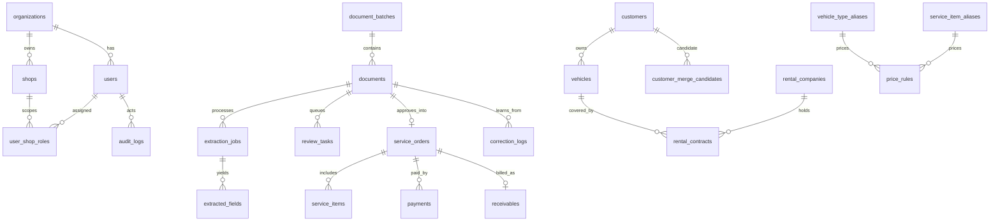

# 데이터 모델

```mermaid
erDiagram
  organizations ||--o{ shops : owns
  organizations ||--o{ users : has
  users ||--o{ user_shop_roles : assigned
  shops ||--o{ user_shop_roles : scopes
  document_batches ||--o{ documents : contains
  documents ||--o{ extraction_jobs : processes
  extraction_jobs ||--o{ extracted_fields : yields
  documents ||--o{ review_tasks : queues
  customers ||--o{ vehicles : owns
  customers ||--o{ customer_merge_candidates : candidate
  documents ||--o| service_orders : approves_into
  service_orders ||--o{ service_items : includes
  service_orders ||--o{ payments : paid_by
  rental_companies ||--o{ rental_contracts : holds
  vehicles ||--o{ rental_contracts : covered_by
  service_orders ||--o| receivables : billed_as
  vehicle_type_aliases ||--o{ price_rules : prices
  service_item_aliases ||--o{ price_rules : prices
  documents ||--o{ correction_logs : learns_from
  users ||--o{ audit_logs : acts
```

모든 업무 테이블에 `organization_id`가 있고 지점 범위가 있는 데이터에는 `shop_id`가 있다. 개인정보 검색은 원문 대신 해시를 사용하고 표시값은 암호화 저장하도록 필드를 분리했다.
